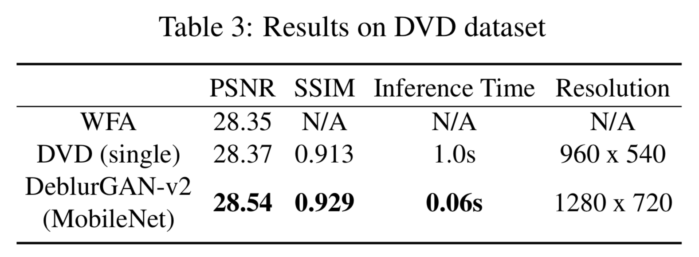

# DeblurGAN-v2: Deblurring (Orders-of-Magnitude) Faster and Better

Code for this paper [DeblurGAN-v2: Deblurring (Orders-of-Magnitude) Faster and Better](https://arxiv.org/abs/1908.03826)

Orest Kupyn, Tetiana Martyniuk, Junru Wu, Zhangyang Wang

In ICCV 2019

## Overview

We present a new end-to-end generative adversarial network (GAN) for single image motion deblurring, named 
DeblurGAN-v2, which considerably boosts state-of-the-art deblurring efficiency, quality, and flexibility. DeblurGAN-v2 
is based on a relativistic conditional GAN with a double-scale discriminator. For the first time, we introduce the 
Feature Pyramid Network into deblurring, as a core building block in the generator of DeblurGAN-v2. It can flexibly 
work with a wide range of backbones, to navigate the balance between performance and efficiency. The plug-in of 
sophisticated backbones (e.g., Inception-ResNet-v2) can lead to solid state-of-the-art deblurring. Meanwhile, 
with light-weight backbones (e.g., MobileNet and its variants), DeblurGAN-v2 reaches 10-100 times faster than 
the nearest competitors, while maintaining close to state-of-the-art results, implying the option of real-time 
video deblurring. We demonstrate that DeblurGAN-v2 obtains very competitive performance on several popular 
benchmarks, in terms of deblurring quality (both objective and subjective), as well as efficiency. Besides, 
we show the architecture to be effective for general image restoration tasks too.

<!---We also study the effect of DeblurGAN-v2 on the task of general image restoration - enhancement of images degraded 
jointly by noise, blur, compression, etc. The picture below shows the visual quality superiority of DeblurGAN-v2 with 
Inception-ResNet-v2 backbone over DeblurGAN. It is drawn from our new synthesized Restore Dataset 
(refer to Datasets subsection below).-->


<!----->
<!----->

## DeblurGAN-v2 Architecture


<!---Our architecture consists of an FPN backbone from which we take five final feature maps of different scales as the 
output. Those features are later up-sampled to the same 1/4 input size and concatenated into one tensor which contains 
the semantic information on different levels. We additionally add two upsampling and convolutional layers at the end of 
the network to restore the original image size  and reduce artifacts. We also introduce a direct skip connection from 
the input to the output, so that the learning focuses on the residue. The input images are normalized to \[-1, 1\].
 e also use a **tanh** activation layer to keep the output in the same range.-->

<!---The new FPN-embeded architecture is agnostic to the choice of feature extractor backbones. With this plug-and-play 
property, we are entitled with the flexibility to navigate through the spectrum of accuracy and efficiency. 
By default, we choose ImageNet-pretrained backbones to convey more semantic-related features.--> 

## Datasets

The datasets for training can be downloaded via the links below:
- [DVD](https://drive.google.com/file/d/1bpj9pCcZR_6-AHb5aNnev5lILQbH8GMZ/view)
- [GoPro](https://drive.google.com/file/d/1KStHiZn5TNm2mo3OLZLjnRvd0vVFCI0W/view)
- [NFS](https://drive.google.com/file/d/1Ut7qbQOrsTZCUJA_mJLptRMipD8sJzjy/view)

## Training

#### Command

```python train.py```

training script will load config under config/config.yaml

#### Tensorboard visualization


## Pre-trained models

<table align="center">
    <tr>
        <th>Dataset</th>
        <th>G Model</th>
        <th>D Model</th>
        <th>Loss Type</th>
        <th>PSNR/ SSIM</th>
        <th>Link</th>
    </tr>
    <tr>
        <td rowspan="3">Restore Dataset</td>
        <td>Inception-ResNet-v2</td>
        <td>double_gan</td>
        <td>ragan-ls</td>
        <td>0.0/ 0.0</td>
        <td><a href=""></a></td>
    </tr>
    <tr>
        <td>ModileNet</td>
        <td>double_gan</td>
        <td>ragan-ls</td>
        <td>0.0/ 0.0</td>
        <td><a href=""></a></td>
    </tr>
    <tr>
        <td>ModileNet-DSC</td>
        <td>double_gan</td>
        <td>ragan-ls</td>
        <td>0.0/ 0.0</td>
        <td><a href=""></a></td>
    </tr>
</table>

## Citation

If you use this code for your research, please cite our paper.

```
​```
@InProceedings{Kupyn_2019_ICCV,
author = {Orest Kupyn and Tetiana Martyniuk and Junru Wu and Zhangyang Wang},
title = {DeblurGAN-v2: Deblurring (Orders-of-Magnitude) Faster and Better},
booktitle = {The IEEE International Conference on Computer Vision (ICCV)},
month = {Oct},
year = {2019}
}
​```
```

